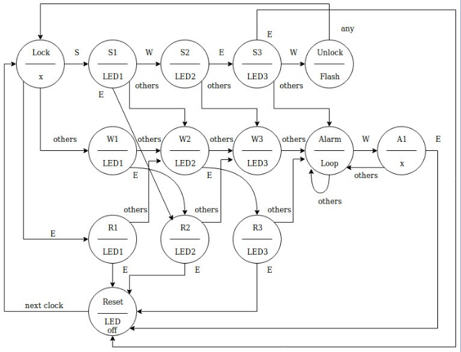
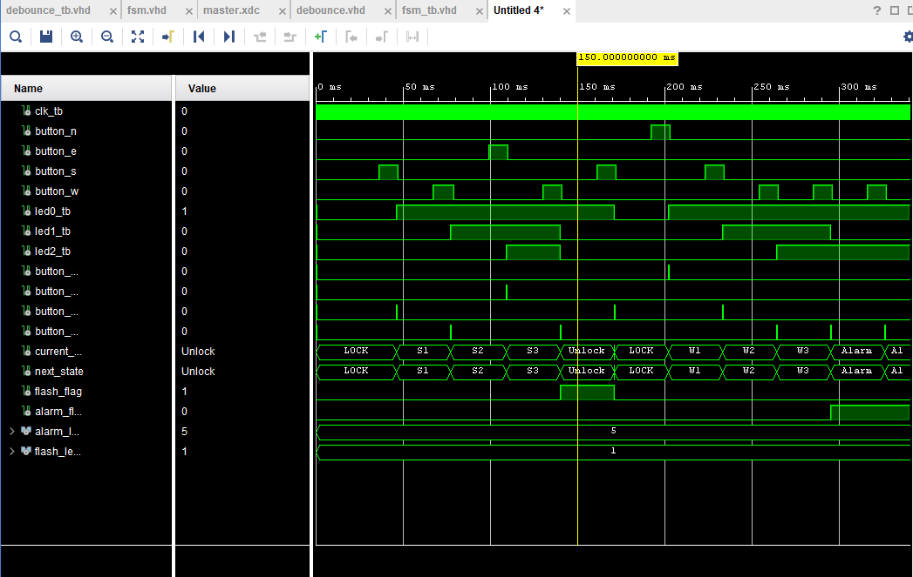
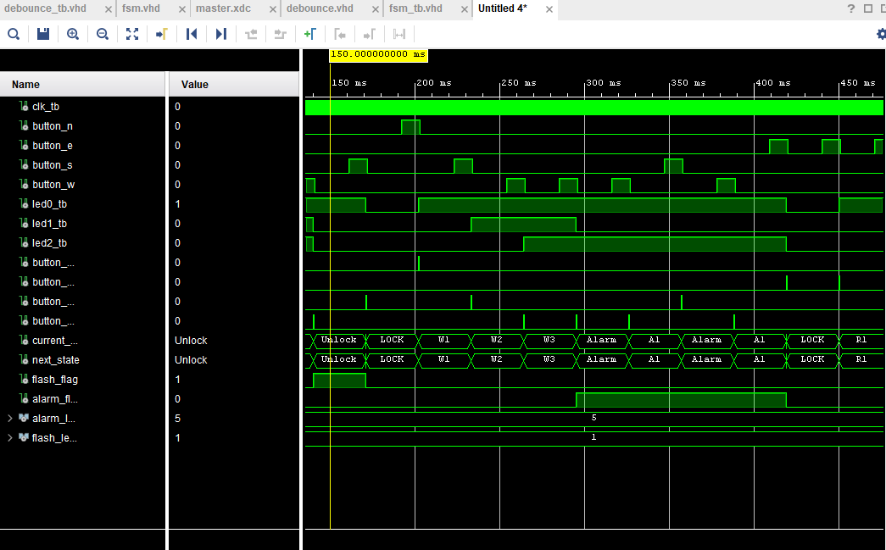
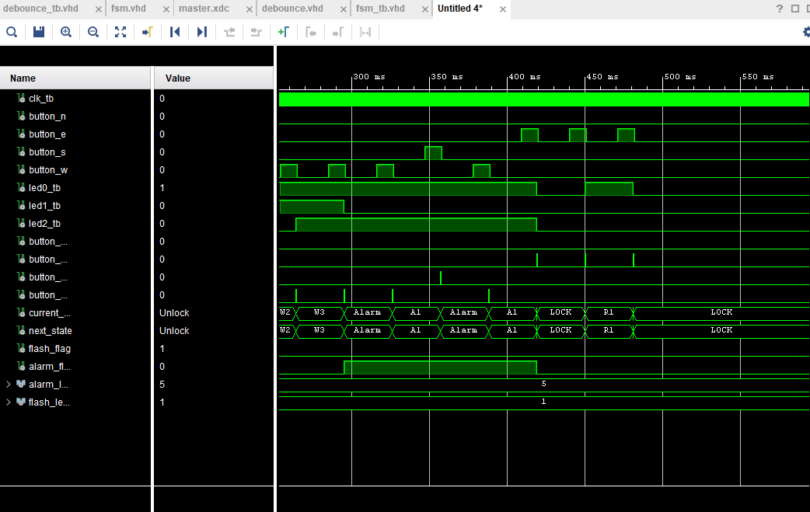
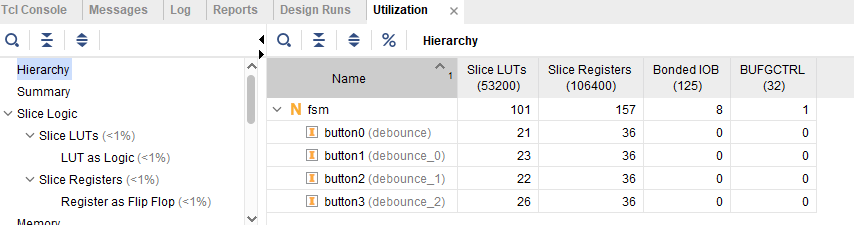
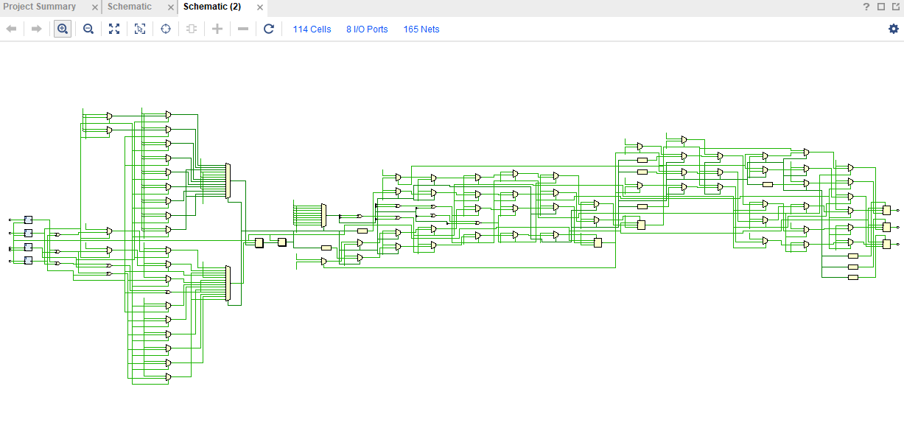
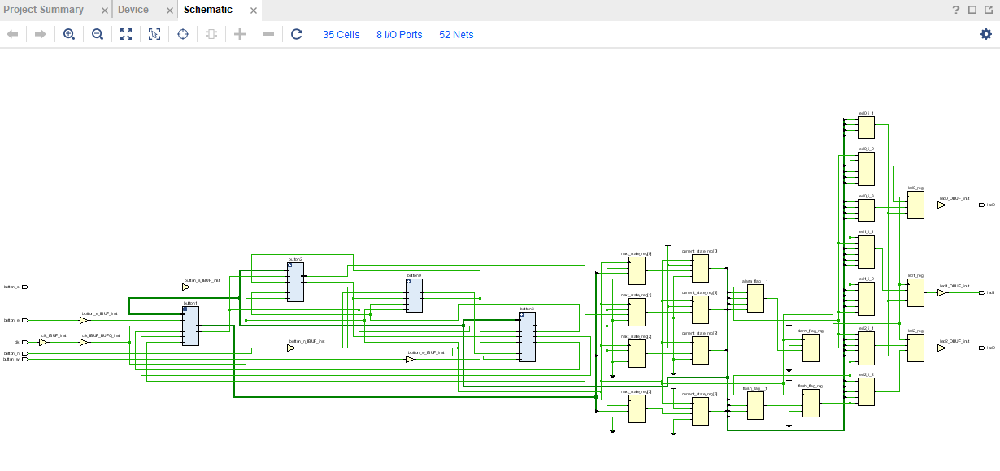
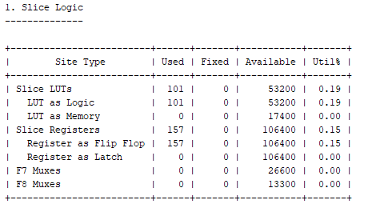
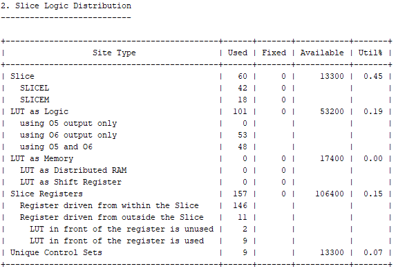

# FSM-Digital-Lock-Design
## FSM Design Digital Lock

## Introduction
The Digital Lock that is designed in this project uses an FSM moore machine. The lock receives a password combination in order to be able to unlock. The password combination input comes from four buttons on the FPGA board. Buttons 0 through Button 3 on the FPGA board correspond to the letters N-E-S-W respectively. In order to be able to unlock the digital lock the password combination S-W-E-W must be received. Any other combinations can lead to an alarm state. In order to be able to reset the alarm, the combination W-E must be received. To reset a combination passsword input, the combination E-E must be received.

## Procedure
1. The FSM of the digital lock can be seen in the figure below. LED's will light up at every state until a Alarm, Reset, or Unlock state has been reached. For an alarm state: LED2 and LED0 will be flashing. For a Unlock state: LED0 will be flashing. For a Reset or Locked state: all LED's will be off.

2. The debounce circuit created is to make sure that a user input has been pressed long enough (10 ms). In order for the debounce circuit to output a logic high, it must detect the start of the press of a button and count to 1250000. This number is calculated by the button press time (10 ms) and the clock frequency of the FPGA board (125 MHz = 8 ns). 
```10ms/8ns = 1,250,000```

## Results
### Correct combination of the digital lock is testbenched below (debounced button output can also be seen).

### Once unlocked, the lock is reset and locked again. Alarm sequence is tested with the incorrect and correct reset sequence.



## Design Results
### Report Utilization

### RTL Analysis Schematic

### Synthesis Schematic

### Report Utilization

### Slice Logic

### Slice Logic Distribution


## Conclusion
Overall, the FSM designed works for every state. In order to able to flash the LED's on the board, a clock divider must be implemented (updating soon) in order to slow down the rate of the LED's and would be visible to the human eye.
